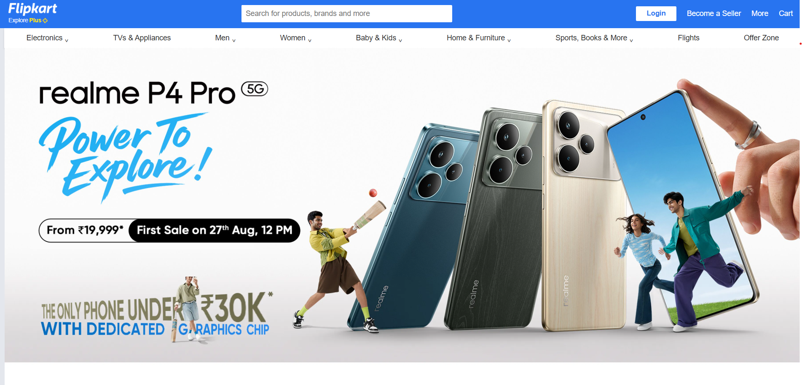

# 🛒 ShopEase – Flipkart Inspired Frontend

A **modern e-commerce frontend clone** inspired by Flipkart, built with **HTML5 + CSS3**.  
This project demonstrates **pixel-perfect UI design, sticky navbar, responsive layout, and a professional shopping experience**.

---

## 🌐 Live Demo
🔗 [Click Here to View](https://prateeksri1308.github.io/ShopEase-E-Commerce-Frontend-Clone/)

---

## 📸 Preview


---

## ✨ Features
- ✅ Fixed **Navbar** with Flipkart-style logo, search, login, and cart  
- ✅ **Search Box** with clean input styling  
- ✅ **Categories Row** for quick navigation  
- ✅ **Footer Section** with grid layout & payment icons  
- ✅ Responsive design (Flexbox + Grid)  
- ✅ Clean & simple code structure  

---

## 🛠️ Tech Stack
- **HTML5** – Semantic structure  
- **CSS3** – Flexbox, Grid, and custom styling  

---

## 📂 Project Structure
ShopEase-E-Commerce-Frontend-Clone/
│── index.html
│── style.css
│── flipkart-plus_8d85f4.png
│── plus_aef861.png
│── assets/
│ └── (images, icons, etc.)

---

## 🚀 Getting Started

1. Clone the repository  
   ```bash
   git clone https://github.com/Prateeksri1308/ShopEase-E-Commerce-Frontend-Clone.git
   
2.  Navigate to project folder
    ```bash
cd ShopEase-E-Commerce-Frontend-Clone

3. Open index.html in your browser

----------
🤝 Contribution

Want to improve this project?
Feel free to fork the repo, open an issue, or submit a PR.

------

📜 License

This project is licensed under the MIT License – you’re free to use, modify, and share.


---


